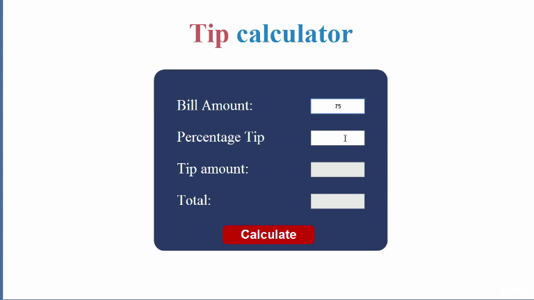

# Simple Tip Calculator

This is a project based on [this course][1] on Udemy (it is the Project #3).

We want to create a simple utility where the user will input the bill amount and
the percentage of the tip he wants to give. The app will calculate the value of tip
along with the total value of the bill (including the tip) and display this information.

Here is an example of the layout:

## Constraints

We want to make the page in the same level of beauty as the example (possibly copy the style).

The page must work on most screens (except tiny ones perhaps).

Everything done in vanilla JavaScript (no outer libraries).

So, **here we go**!

[1]: https://www.udemy.com/17-complete-javascript-projects-explained-step-by-step/
